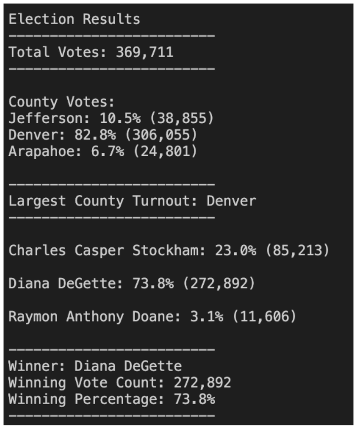

# Python_Election_Analysis
Python Election Analysis 

Analysis of election results using Python
1. Printed to the Command Line
2. Saved to a txt file
3. Written Analysis of the Election

# Resources
* Data Source: election_results.csv
* Software: Python 3.9.9, Visual Studio Code 1.63.2

## Election-Audit Results:
Guidance: Using a bulleted list, addresss the following
election outcomes. Use images or examples of Python code as 
support where necessary.

# Specified "Asks:"
* How many votes were cast in this election
    Candidate Results
    - Total_Votes: 
    - Each Candidate total votes
    - Winner of the election

    County Results
    - Total Vote Count
    - Total Percentage
    - County Winner

## Results as recorded in my election_analysis.txt file

## Election-Audit Python Code Summary