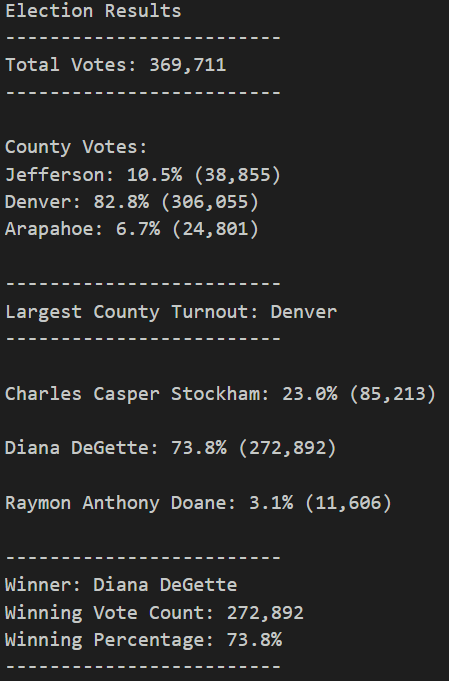

# Python_Election_Analysis
Python Election Analysis 

Analysis of election results using Python
1. Printed to the Command Line
    I used the Visual Studio Code terminal editor to show the results of each update as I wrote the code.
2. Saved to a txt file
    The outputs were saved to a seperate txt file for ease of access, and future updates in case the program / code was to be used in future elections.
3. Written Analysis of the Election
    The election shows that Denver had the greatest input of votes cast. Jefferson was second highest, though still far behind Denvers, and Arapahoe came in last. The Winner of the election was Diana Degette with 272,892 total votes.

# Resources
* Data Source: election_results.csv
* Software: Python 3.9.9; Visual Studio Code 1.63.2

## Election-Audit Results:
    This heading is redundant as the information requested is listed in the next section.

## Specified "Asks:"
* How many votes were cast in this election
    Candidate Results
    - Total_Votes: 369,711

    - Each Candidate, Total Percentage, and Total Votes: 
        Charles Casper Stockham: 23.0% (85,213)
        Diana DeGette: 73.8% (272,892)
        Raymon Anthony Doane: 3.1% (11,606)

    - Winner of the election: 
        Diana DeGette

    County Results
    - Total Vote Percentage and Count
        Jefferson: 10.5% (38,855)
        Denver: 82.8% (306,055)
        Arapahoe: 6.7% (24,801)

    - County Winner
        Denver

## Results as recorded in my election_analysis.txt file

## Election-Audit Python Code Summary
    The Python Code can be re-used in future elections or more counties. It was not hard to write, though it did take time as we assessed the requirements needed. 